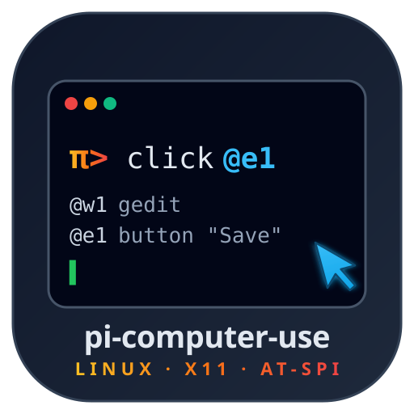
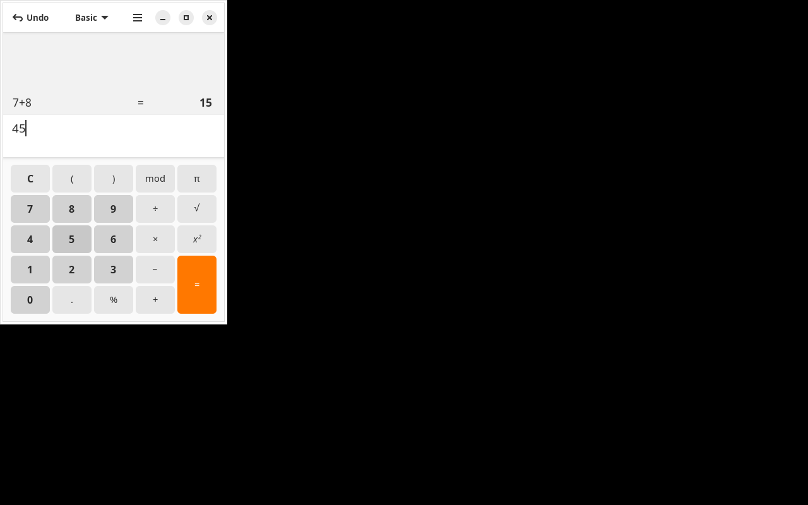
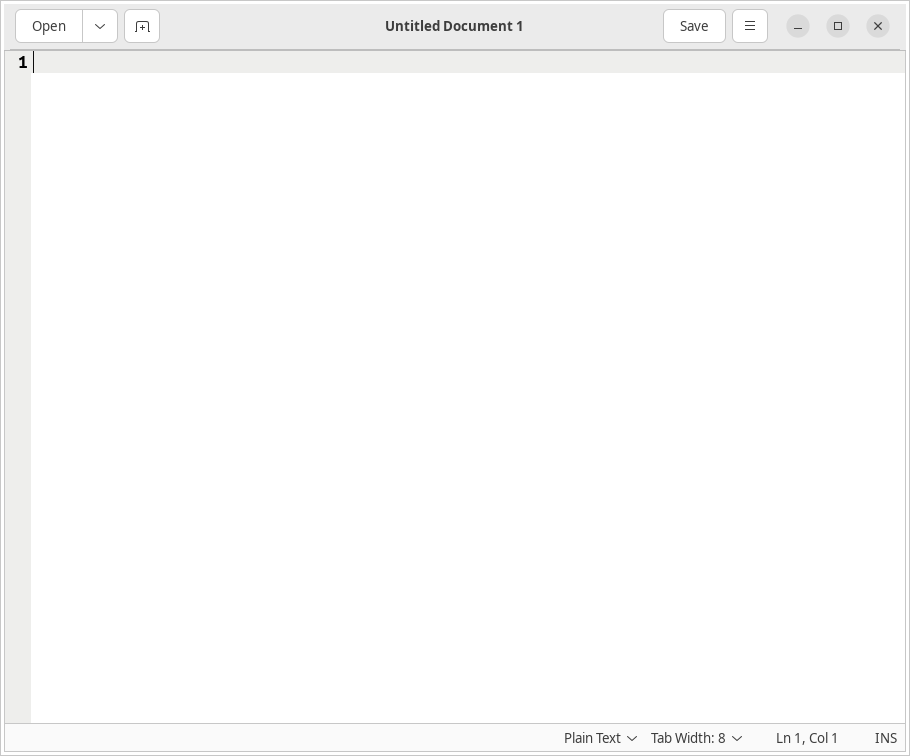
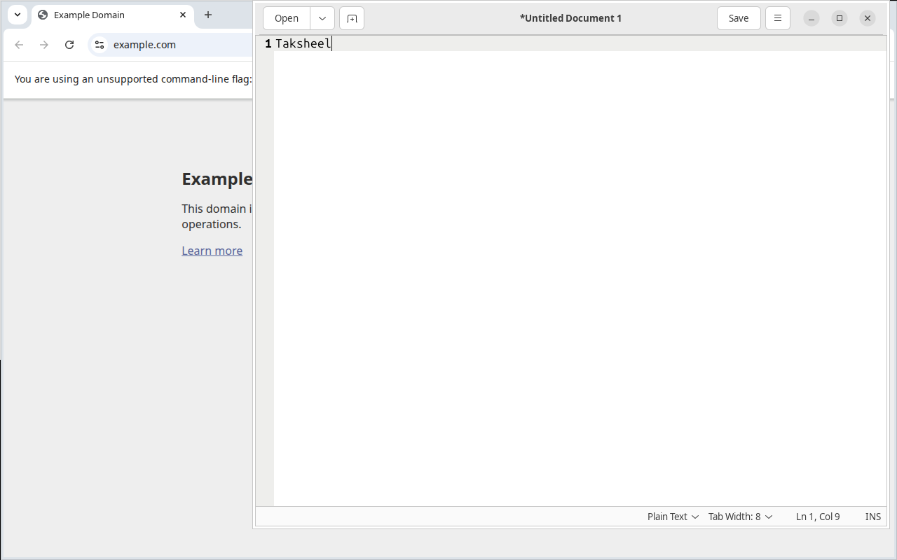

<p align="center">
  
</p>

<h1 align="center">pi-computer-use-linux</h1>

<p align="center">
  <em>Token-efficient Linux/X11 computer-use tools for <a href="https://github.com/mariozechner/pi-coding-agent">Pi</a>.</em>
</p>

<p align="center">
  <a href="LICENSE"></a>
  
  
  
  <a href="https://github.com/tak-uukti/pi-computer-use-linux/releases"></a>
</p>

A Linux port of [`@injaneity/pi-computer-use`](https://github.com/injaneity/pi-computer-use). Same idea — give the [Pi coding agent](https://github.com/mariozechner/pi-coding-agent) a semantic computer-use surface for visible windows so it can prefer accessibility refs (`@e1`) over raw coordinates, and only attach screenshots when the AX tree is too sparse to act reliably.

The macOS original uses Apple's Accessibility API, AppleScript, and ScreenCaptureKit (~6,800 lines of Swift + TS). This port replaces the entire native layer with **AT-SPI 2 + xdotool + scrot**, ships a single ~470-line Python bridge, and trims the tool surface from 15 → **8** to keep prompts cheap.

| | upstream macOS | this port |
|---|---|---|
| Total LOC | ~6,866 | **~1,020** (-85%) |
| Tools registered | ~15 | **8** |
| Native helper | 2,065 lines Swift | **471 lines Python** |
| Runtime deps | Swift toolchain, codesign | `python3-gi`, `xdotool`, `wmctrl`, `scrot` |
| Token budget per turn | larger | trimmed schemas, terse descriptions |

## Quick start

```bash
# 1. system deps (Debian/Ubuntu)
sudo apt-get install -y python3 python3-gi gir1.2-atspi-2.0 xdotool wmctrl scrot

# 2. enable AT-SPI on the desktop session (GNOME)
gsettings set org.gnome.desktop.interface toolkit-accessibility true

# 3. install as a Pi extension
pi install git:github.com/tak-uukti/pi-computer-use-linux@v0.1.1
```

The postinstall script writes a small bash wrapper to `~/.pi/agent/helpers/pi-computer-use-linux/bridge` that execs `python3 bridge/bridge.py`. No build step, no codesign, no native compile.

In a Pi session, call `screenshot` first — it picks the focused window, returns AT-SPI refs (`@e1`, `@e2`, …) plus a PNG, and from there you can `click({ref:"@e3"})`, `set_text({ref:"@e2", text:"…"})`, etc.

```ts
list_windows()
screenshot({ window: "@w1" })
click({ ref: "@e3" })
type_text({ text: "Taksheel" })
keypress({ keys: ["Return"] })
```

## Tools

8 total. Schemas are deliberately terse — see [`extensions/computer-use.ts`](./extensions/computer-use.ts).

| name | purpose |
|---|---|
| `list_windows` | enumerate visible X11 windows; returns `@wN`, title, pid, geometry, focus state |
| `screenshot` | focus a window, capture PNG, walk AT-SPI tree → `@eN` targets with role / name / bounds / capabilities |
| `click` | click `@eN`, `@wN`, or `x,y`; supports `button` and `clickCount` |
| `type_text` | xdotool-type literal text at the cursor |
| `set_text` | replace value of an `@eN` text/entry via AT-SPI EditableText (falls back to focus + Ctrl+A + type) |
| `keypress` | press keys/chords — `["Return"]`, `["Ctrl","A"]`, `["ctrl+l","Return"]`, etc. |
| `scroll` | scroll at ref/coords by pixel delta |
| `computer_actions` | batch up to 20 actions in a single call |

## Architecture

```
┌──────────────────────┐
│  Pi coding agent     │  ── (TypeScript ESM)
└──────────┬───────────┘
           │  registerTool() x8
           ▼
┌──────────────────────┐
│  extensions/         │   slim tool registrations + JSON schemas
│  computer-use.ts     │
└──────────┬───────────┘
           │  typed methods
           ▼
┌──────────────────────┐
│  src/bridge.ts       │   long-lived subprocess + JSON-line protocol
└──────────┬───────────┘
           │  newline-delimited JSON over stdio
           ▼
┌──────────────────────┐
│  bridge/bridge.py    │   AT-SPI walk · xdotool input · wmctrl windows · scrot capture
└──────────────────────┘
```

The AT-SPI walker is depth-capped (12) and element-capped (200) to keep prompts lean. Element bounds use SCREEN coords with a fallback to WINDOW coords + window offset (necessary for GTK4 / Xwayland which report SCREEN as 0,0).

## Verified end-to-end

These captures are from the bridge running against a `Xvfb :99` + openbox session, driving real Linux apps. All four screenshots were taken via `scrot` after the bridge issued the actions.

### gnome-calculator — `keypress` flow

`keypress: 7`, `+`, `8`, `Return` → display shows `15`. **26 AT-SPI elements** detected, every push button reports `canPress: true` and accurate bounds.

<p align="center">
  
</p>

### gnome-calculator — AT-SPI `@eN` ref clicks

`computer_actions: [click @e3, click @e7]` (which the bridge resolves to push buttons "4" and "5") → display shows `45`.

<p align="center">
  
</p>

### gedit — full type_text round-trip

`type_text: "Hello sir, … Linux X11 + AT-SPI + xdotool working end-to-end."` → 169 characters typed. **190 AT-SPI elements** found in gedit's window.

<p align="center">
  
</p>

### gedit — clear and retype

`keypress ctrl+a` → `keypress Delete` → `type_text "Taksheel"`. Status bar reads `Ln 1, Col 9`.

<p align="center">
  
</p>

## App compatibility matrix

| App | screenshot | AT-SPI refs | input |
|---|---|---|---|
| gnome-calculator | ✅ | ✅ 26 elements, full action metadata | ✅ |
| gedit | ✅ | ✅ 190 elements | ✅ |
| GTK / Qt apps with AT-SPI | ✅ | ✅ | ✅ |
| Google Chrome / Chromium | ✅ | ⚠️ AT-SPI tree empty unless launched with `--force-renderer-accessibility` | ✅ (coords / keypress) |
| Firefox | ✅ | ✅ on a real session (gates on `gsettings toolkit-accessibility`) | ✅ |
| Electron apps | ✅ | ⚠️ same as Chrome — needs `--force-renderer-accessibility` | ✅ |
| LibreOffice (real Xorg session) | ✅ | ✅ via `SAL_USE_COMMON_ONE_ACCESSIBILITY=1` | ✅ |
| Xvfb / nested X | ✅ | partial (some apps misbehave under Xvfb without a real session bus) | ✅ |

## Limitations (v0.1.x)

- **X11 only.** Wayland sessions cannot capture other-app windows or synthesize input via xdotool. Run a GNOME-on-Xorg, KDE-on-X11, or XFCE session.
- **Apps must export AT-SPI** for `@eN` refs to populate. Most GTK / Qt apps do; Electron / Chromium need `--force-renderer-accessibility`.
- **Mouse cursor physically moves** — no stealth pointer on X11.
- Dropped vs upstream: `move_mouse`, `drag`, `wait`, `double_click`, `arrange_window`, `navigate_browser`, `list_apps`. Use `keypress`, `type_text`, and `computer_actions` to compose what you need.

## Development

```bash
git clone https://github.com/tak-uukti/pi-computer-use-linux
cd pi-computer-use-linux
npm install                                                # @types/node + typescript only
npm run typecheck                                          # tsc -p tsconfig.json
python3 -c "import ast; ast.parse(open('bridge/bridge.py').read())"
echo '{"id":"1","cmd":"list_windows"}' | python3 bridge/bridge.py
```

The Pi extension API surface (`ExtensionAPI`, `ToolDef`, `AgentToolResult`) is stubbed locally in [`src/types.ts`](./src/types.ts) so typecheck runs without `@mariozechner/pi-coding-agent` installed.

## Layout

```
.
├── assets/                          logo + screenshots
├── bridge/
│   ├── bridge.py                    471-line Python helper (AT-SPI + xdotool + scrot)
│   └── requirements.txt
├── extensions/
│   └── computer-use.ts              tool registration + JSON schemas
├── scripts/
│   └── setup-helper.mjs             postinstall — writes ~/.pi/.../bridge wrapper
├── skills/computer-use/SKILL.md     pi skill — Quick Start + Pitfalls
├── src/
│   ├── bridge.ts                    subprocess manager + JSON-line protocol
│   └── types.ts                     local stubs for the pi-coding-agent extension API
├── package.json
├── tsconfig.json
├── CHANGELOG.md
├── LICENSE
└── README.md
```

## Credits

- [`@injaneity/pi-computer-use`](https://github.com/injaneity/pi-computer-use) — macOS original, design and protocol shape.
- [`@mariozechner/pi-coding-agent`](https://github.com/mariozechner/pi-coding-agent) — the agent that loads this extension.
- AT-SPI 2, xdotool, wmctrl, scrot — the Linux building blocks doing all the real work.

## License

MIT © 2026 [Tak1tak](https://bytak.in) · built by Tak1tak
